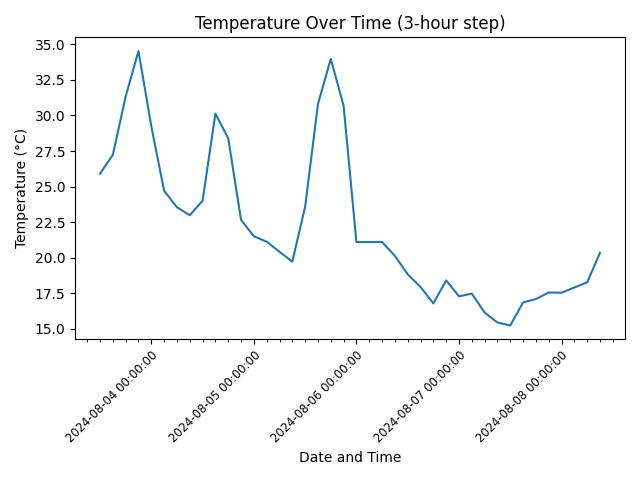
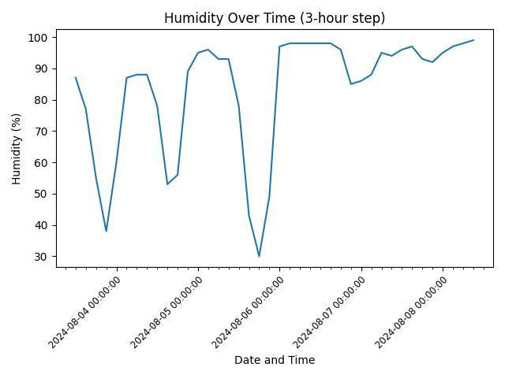
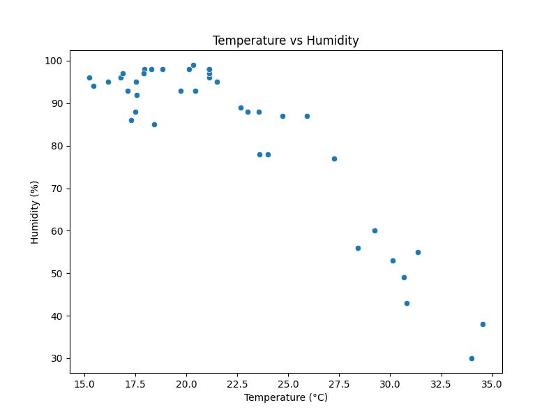
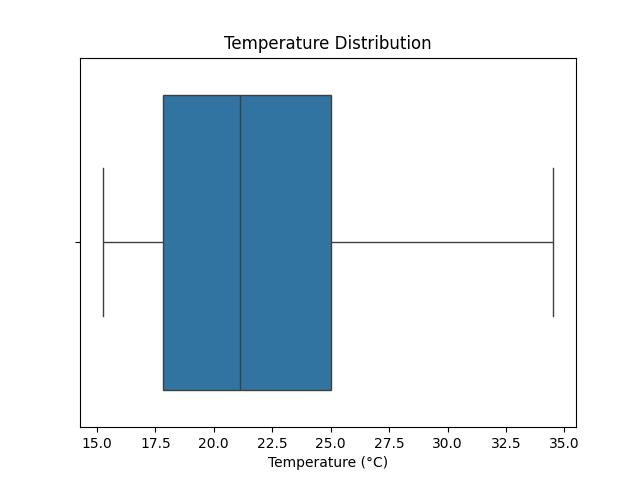
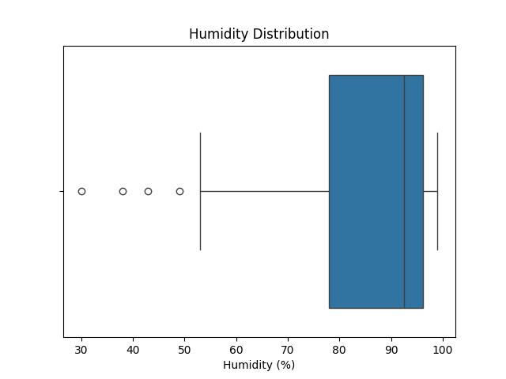

# **Weather Data Analysis Project**

This project analyzes 5-day weather forecast data for a specified city using the **OpenWeatherMap API**. It extracts, processes, and visualizes key weather metrics such as temperature and humidity, providing insights into weather trends over time.

---

## **Table of Contents**  
1. [Overview](#overview)  
2. [Features](#features)  
3. [Installation](#installation)  
4. [Usage](#usage)  
5. [Project Structure](#project-structure)  
6. [Key Visualizations](#key-visualizations)  
7. [Contributing](#contributing)  
8. [License](#license)  

---

## **Overview**  
This project uses Python to:  
- Fetch 5-day weather forecast data from **OpenWeatherMap API**.  
- Extract and process temperature, humidity, and weather descriptions.  
- Save raw and processed data in JSON and CSV formats.  
- Generate insightful visualizations to analyze weather trends.  

---

## **Features**  
- **Data Extraction**: Fetches weather data in real-time using the OpenWeatherMap API.  
- **Data Processing**: Cleans and structures data into a Pandas DataFrame for analysis.  
- **Visualizations**:  
  - Temperature and humidity trends over time.  
  - Scatter plots for temperature vs. humidity.  
  - Box plots for temperature and humidity distributions.  
- **Error Handling**: Robust error handling for API requests, data extraction, and visualization.  

---

## **Installation**  
1. Clone the repository:  
   ```bash
   git clone https://github.com/your-username/weather-data-analysis.git
   cd weather-data-analysis
   ```

2. Install the required dependencies:  
   ```bash
   pip install -r requirements.txt
   ```

3. Add your OpenWeatherMap API key:  
   - Replace `api_key` in the script with your own API key from [OpenWeatherMap](https://openweathermap.org/api).  

---

## **Usage**  
1. Run the script:  
   ```bash
   python weather_analysis.py
   ```

2. Outputs:  
   - **Raw Data**: Saved as `data/raw-data.json`.  
   - **Processed Data**: Saved as `data/data-extract.csv`.  
   - **Visualizations**: Saved in the `figures/` directory.  

---

## **Project Structure**  
```
weather-data-analysis/
├── data/
│   ├── raw-data.json          # Raw JSON data from API
│   ├── data-extract.csv       # Processed CSV data
├── figures/                   # Generated visualizations
│   ├── temperature.jpg        # Temperature trend plot
│   ├── humidity.jpg           # Humidity trend plot
│   ├── temperature-vs-humidity.jpg  # Scatter plot
│   ├── temperature-distribution.jpg # Temperature box plot
│   ├── humidity-distribution.jpg    # Humidity box plot
├── weather_analysis.py        # Main script
├── README.md                  # Project documentation
├── requirements.txt           # Required dependencies
```

---

## **Key Visualizations**  
### **1. Temperature Over Time**  
  
*Line plot showing temperature trends over a 5-day period.*  

### **2. Humidity Over Time**  
  
*Line plot showing humidity trends over a 5-day period.*  

### **3. Temperature vs. Humidity**  
  
*Scatter plot exploring the relationship between temperature and humidity.*  

### **4. Temperature Distribution**  
  
*Box plot showing the distribution of temperatures.*  

### **5. Humidity Distribution**  
  
*Box plot showing the distribution of humidity.*  

---

## **Contributing**  
Contributions are welcome! To contribute:  
1. Fork the repository.  
2. Create a new branch:  
   ```bash
   git checkout -b feature/your-feature-name
   ```  
3. Commit your changes:  
   ```bash
   git commit -m "Add your commit message here"
   ```  
4. Push to the branch:  
   ```bash
   git push origin feature/your-feature-name
   ```  
5. Submit a pull request.  

---

## **License**  
This project is licensed under the **MIT License**. See [LICENSE](LICENSE) for details.  

---

## **Acknowledgments**  
- Data sourced from [OpenWeatherMap API](https://openweathermap.org/api).  
- Built with Python libraries: `requests`, `pandas`, `matplotlib`, and `seaborn`.  
